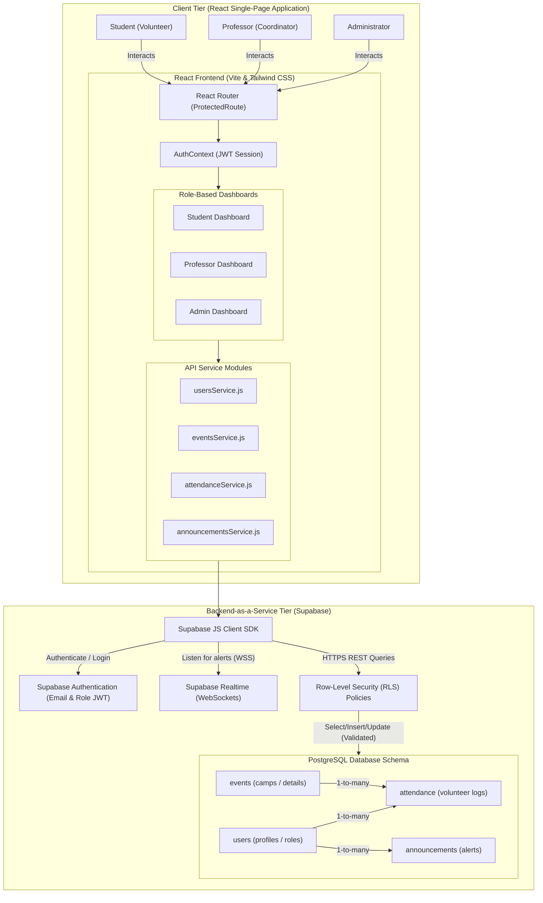

# System Design & Architecture - NSS Connect Platform

This document describes the live, secure system architecture of the **NSS Connect Platform**, illustrating how the frontend React client interacts with Supabase services and PostgreSQL tables.

---

## Architecture Diagram (Mermaid)

Below is the live system design diagram. You can copy this code block into any markdown viewer, GitHub repository, or Mermaid live editor.

---

## Architectural Component Breakdown

### 1. Client Tier (Frontend Application)
* **Technology**: React.js with Vite builder and Tailwind CSS styling.
* **Router & Protection (`ProtectedRoute.jsx`)**: Checks the active user session and validates their role (Student, Professor, or Admin) before resolving routing paths.
* **Authentication Context (`AuthContext.jsx`)**: Establishes global React state tracking for user login, signup, session logs, and signout handlers.
* **Service Modules**: JavaScript modules (e.g., `usersService.js`, `eventsService.js`) encapsulate DB communications, making UI components cleaner and more reusable.

### 2. Backend-as-a-Service Tier (Supabase)
* **Supabase Client SDK**: Communicates securely over HTTPS/WSS protocols.
* **Supabase Auth**: Manages JWT tokens, signups, logins, and session persistence securely without managing raw passwords locally.
* **Realtime Listener**: Opens a persistent WebSocket connection (`S_Realtime`) so that when a coordinator adds an announcement, student dashboards show immediate toast banners.

### 3. Database & Security Tier
* **PostgreSQL Engine**: Relational storage engine hosting structured schemas:
  * `users` / `profiles`: Stores details (name, email, role, college).
  * `events`: Tracks camps, campaign details, descriptions, and capacity limits.
  * `attendance`: Maps student check-ins and verified volunteering hours.
  * `announcements`: Stores notification broadcasts.
* **Row-Level Security (RLS)**: Crucial security rules evaluated in the DB, preventing students from editing hours or coordinators from accessing other college programs.
